# Laravel Starter Kit

*   **Nama** Mohamad Syahlefi Ghoni Al Maghfur
*   **NIM / KELAS** 23091397117 / 2023D
*   **Prodi** D4 Manajemen Informatika
*   **Mata Kuliah** UAS - Pemrograman Web Lanjut
*   **Universitas** Universitas Negeri Surabaya

Laravel Starter Kit adalah aplikasi web dasar yang dibangun dengan Laravel, menyediakan fitur-fitur penting seperti autentikasi pengguna, manajemen peran (role-based access control), dan fungsionalitas CRUD (Create, Read, Update, Delete) untuk kategori dan berita. Proyek ini cocok sebagai fondasi untuk aplikasi web yang lebih kompleks.

## Tampilan Antarmuka Aplikasi

Berikut adalah beberapa gambaran tampilan antarmuka dari aplikasi ini:

### Halaman Selamat Datang

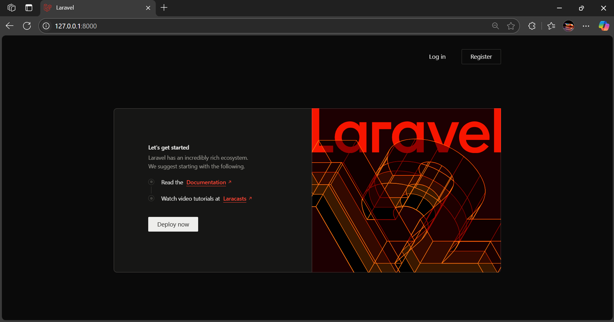

### Halaman Registrasi

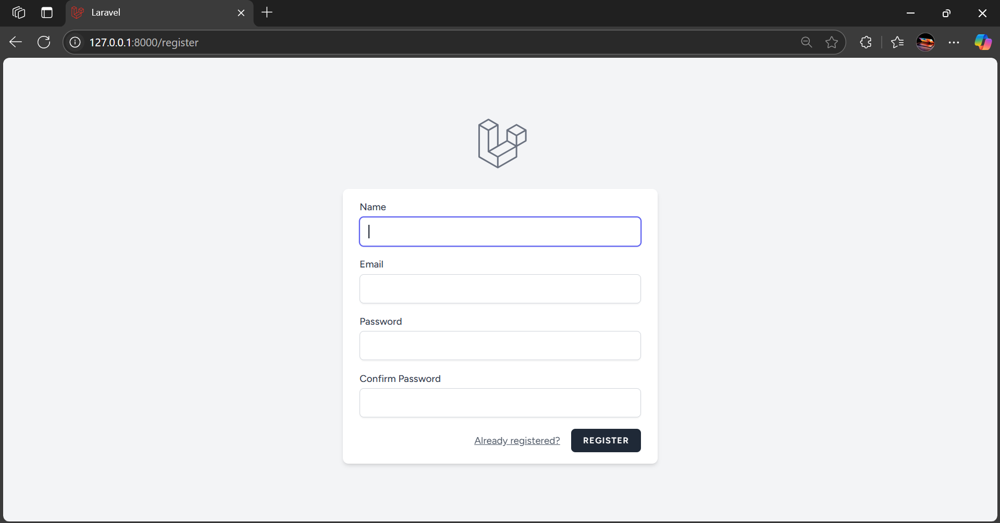

### Halaman Login

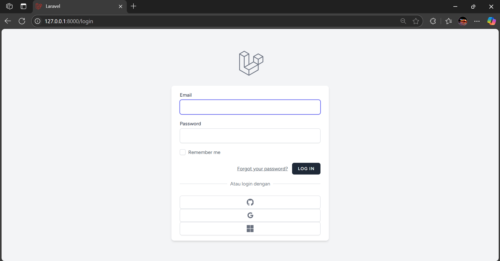

**Pada halaman login ini, pengguna bisa masuk langsung atau via github, google, ataupun microsoft. (Catatan: untuk melakukan login via pihak ketiga(seperti google), lakukan daftar & setup pada google cloud untuk mendapatkan client_id, client_secret,dll. Atau lebih jelasnya buka [link berikut](https://youtu.be/R7_zvfv2C1g?si=FEygPi2T4VT7QFhD))**
**Berikut akun default untuk Login:**
*   **Admin**
    *   Email: `admin@admin.com`
    *   Password: `password`
    *   Fitur: Akses penuh CRUD berita & kategori, dapat mengubah status berita (publish/draft), melihat semua berita.
*   **Editor**
    *   Email: `editor@editor.com`
    *   Password: `password`
    *   Fitur: Dapat mengubah status berita (publish/draft), melihat semua berita.
*   **Wartawan**
    *   Email: `wartawan@wartawan.com`
    *   Password: `password`
    *   Fitur: Dapat membuat berita baru (otomatis draft), mengedit/menghapus berita sendiri, tidak bisa mengubah status berita.

### Halaman Lupa Kata Sandi

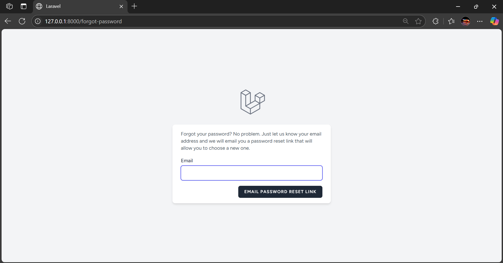

### Halaman Dashboard

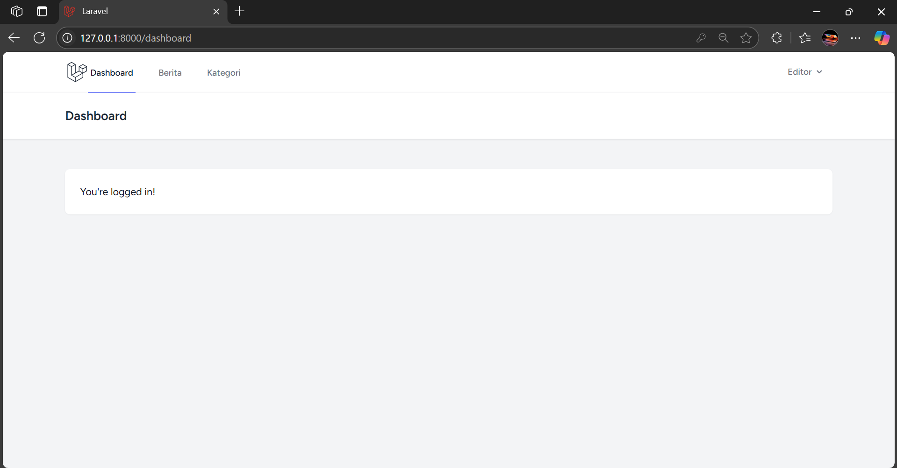

**Pada halaman ini, default milik laravel**

### Halaman Daftar Berita (Editor)

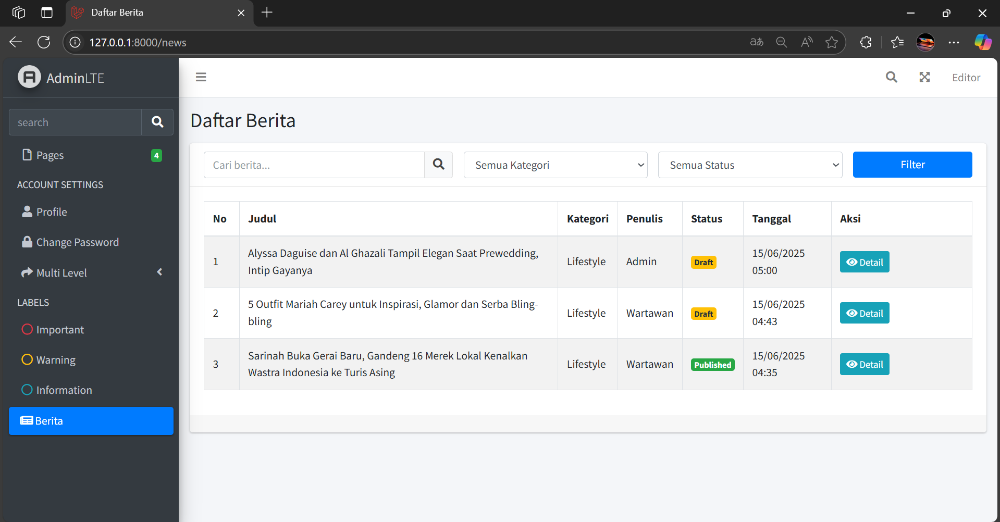

**Pada halaman ini dan seterusnya kebawah menggunakan template AdminLTE**

### Halaman Publikasi Berita (Editor)

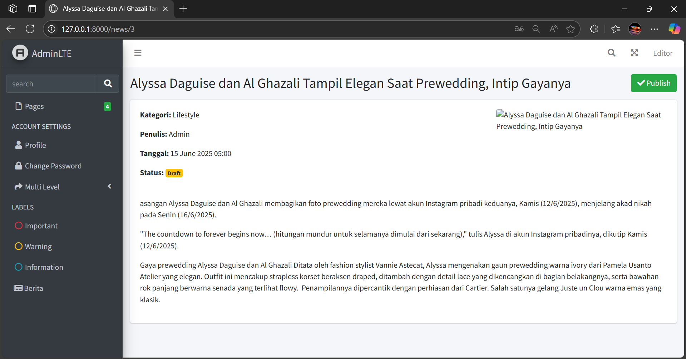

**Editor bisa mengubah status berita menjadi Publish atau Unpublish**

### Halaman Profil

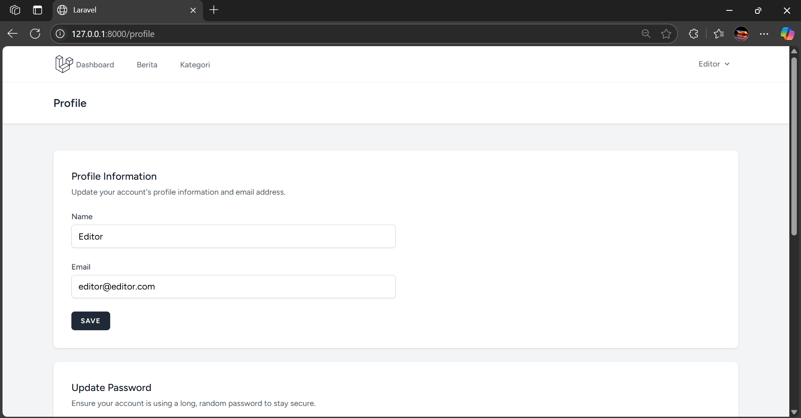

**Pada halaman ini, tiap user yang login bisa melakukan edit profile pada masing-masing akun**

### Halaman Daftar Berita (Admin)

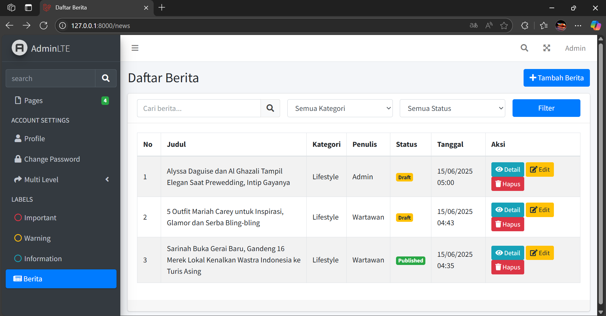

### Halaman Tambah Berita (Admin)

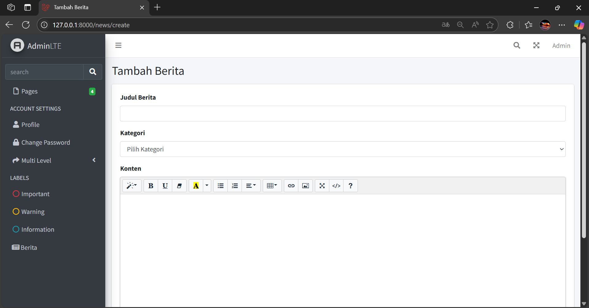

### Halaman Kategori

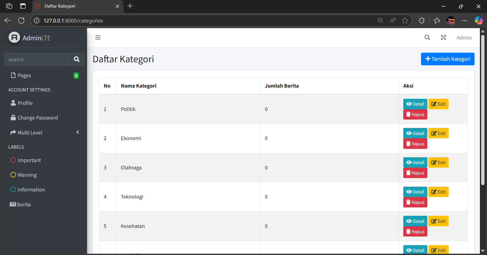

### Halaman Daftar Berita (Wartawan)

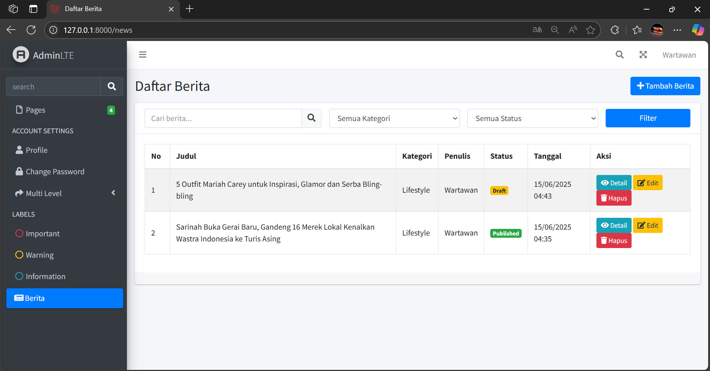

### Halaman Tambah Berita (Wartawan)

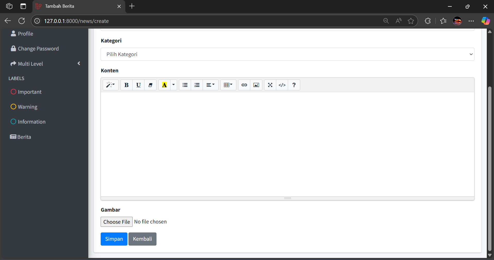

## Fitur Utama

*   **Autentikasi Pengguna**: Sistem login dan registrasi dasar.
*   **Manajemen Peran**: Tiga peran pengguna (`admin`, `editor`, `wartawan`) dengan izin akses yang berbeda.
*   **Manajemen Berita**:
    *   CRUD Berita (buat, lihat, edit, hapus).
    *   Pengelolaan status berita (Draft/Published) oleh `admin` dan `editor`.
    *   Wartawan hanya dapat membuat berita dengan status `draft`.
*   **Manajemen Kategori**: CRUD untuk kategori berita.
*   **Antarmuka Admin**: Menggunakan AdminLTE untuk tampilan panel admin yang bersih dan fungsional.

## Prasyarat

Sebelum Anda memulai, pastikan Anda telah menginstal perangkat lunak berikut di sistem Anda:

*   **PHP** (Versi 8.1 atau lebih tinggi)
*   **Composer**
*   **Node.js** dan **npm** (atau Yarn)
*   **Git**
*   **Database** (MySQL sangat direkomendasikan, atau PostgreSQL, SQLite)
*   **Web Server** (Apache, Nginx, atau server bawaan PHP)

## Langkah-langkah Instalasi

Ikuti langkah-langkah di bawah ini untuk menginstal dan menjalankan proyek di lingkungan lokal.

### 1. Kloning Repositori

Buka terminal atau Git Bash Anda dan kloning repositori proyek:

```bash
git clone https://github.com/mohamadsyahlefi/starter_kit.git
cd starter_kit
```

### 2. Instal Dependensi Composer

Navigasi ke direktori proyek dan instal dependensi PHP menggunakan Composer:

```bash
composer install
```

### 3. Konfigurasi Lingkungan

Salin file `.env.example` menjadi `.env`. File `.env` ini akan berisi konfigurasi spesifik lingkungan Anda.

```bash
cp .env.example .env
```

### 4. Buat Kunci Aplikasi

Laravel memerlukan kunci aplikasi yang unik. Anda dapat membuatnya dengan perintah berikut:

```bash
php artisan key:generate
```

### 5. Konfigurasi Database

Buka file `.env` yang baru dibuat dan konfigurasikan detail database Anda:

```dotenv
DB_CONNECTION=mysql
DB_HOST=127.0.0.1
DB_PORT=3306
DB_DATABASE=nama_database_anda
DB_USERNAME=username_database_anda
DB_PASSWORD=password_database_anda
```

**Ganti `nama_database_anda`, `username_database_anda`, dan `password_database_anda` dengan detail database Anda. Pastikan Anda telah membuat database kosong dengan nama yang sesuai di server database Anda.**

### 6. Migrasi Database dan Seeder

Jalankan migrasi database untuk membuat tabel, dan jalankan seeder untuk mengisi data awal (termasuk peran dan pengguna default):

```bash
php artisan migrate:fresh --seed
```

**Catatan:** Perintah ini akan menghapus semua data yang ada di database Anda sebelum menjalankan migrasi dan seeder. Jika Anda ingin menjalankan seeder secara terpisah:
```bash
php artisan db:seed --class=RoleSeeder
php artisan db:seed --class=UserSeeder
php artisan db:seed --class=CategorySeeder
```

### 7. Instal Dependensi Node.js

Instal dependensi frontend menggunakan npm (atau Yarn):

```bash
npm install
# Atau jika Anda menggunakan Yarn:
# yarn install
```

### 8. Kompilasi Aset Frontend

Kompilasi aset CSS dan JavaScript:

```bash
npm run dev
# Untuk produksi:
# npm run build
```

### 9. Jalankan Server Lokal

Anda dapat menjalankan server pengembangan Laravel bawaan:

```bash
php artisan serve
```

Aplikasi sekarang harus dapat diakses di `http://127.0.0.1:8000` (atau port lain yang ditampilkan di terminal).

### 10. Buat Link Simbolik untuk Penyimpanan

Jika Anda mengunggah gambar atau file lain dan menyimpannya ke direktori `storage/app/public`, Anda perlu membuat link simbolik agar file tersebut dapat diakses melalui web:

```bash
php artisan storage:link
```


Selamat menggunakan Laravel Starter Kit!
Starterkit ini di buat oleh [Mohamad Syahlefi Ghoni Al Maghfur](https://www.linkedin.com/in/mohamadsyahlefi)
